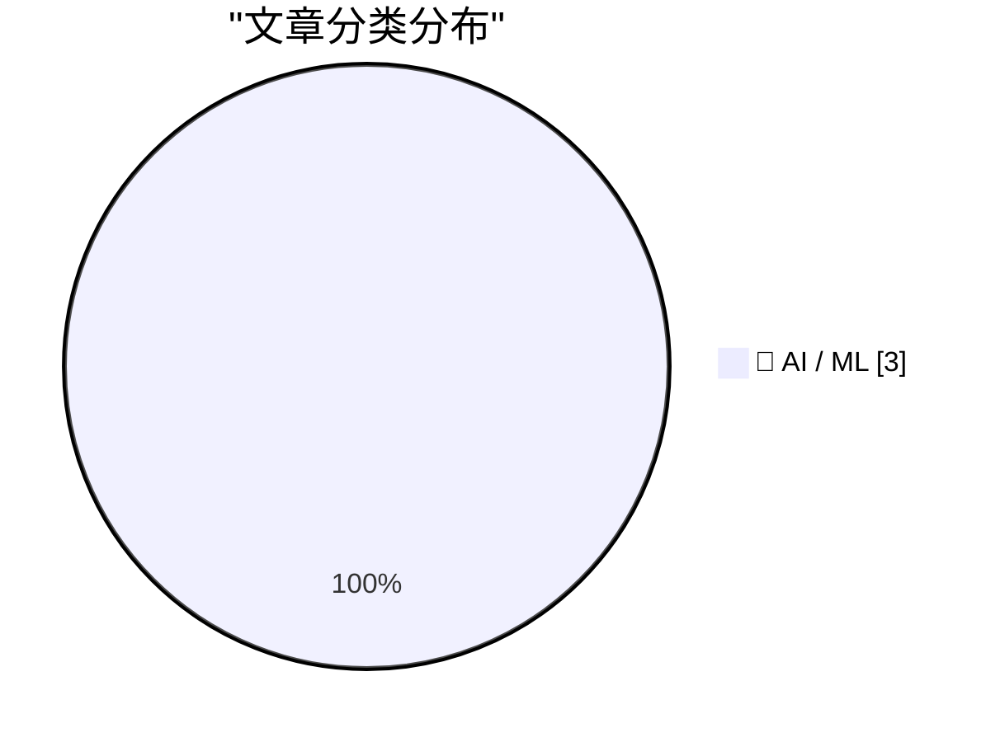
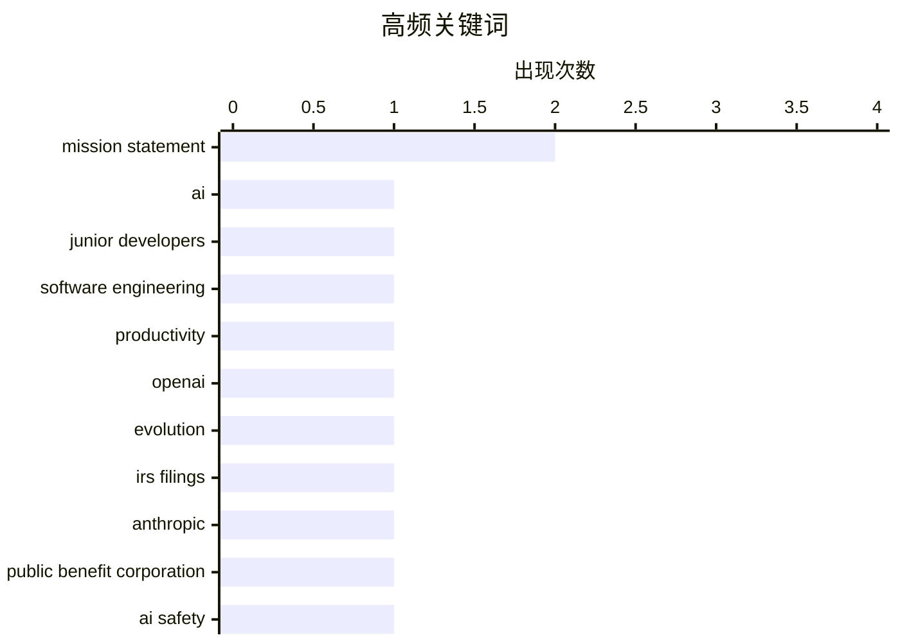

# 📰 AI 博客每日精选 — 2026-02-14

> 来自 Karpathy 推荐的 92 个顶级技术博客，AI 精选 Top 3

## 📝 今日看点

今日看点：AI工具正重塑开发者职业路径，Thoughtworks指出AI让初级开发者比历史上任何时期都更快产生价值并更具盈利能力，挑战了“AI淘汰新人”的传统担忧。同时，OpenAI和Anthropic等前沿机构的使命演变持续引发关注，从早期强调开放共享与无回报约束，逐步向负责任、安全、可控的先进AI发展倾斜，反映出行业在技术狂飙与公共利益之间寻求更清晰的平衡。

---

## 🏆 今日必读

🥇 **引用 Thoughtworks 的观点：AI 让初级开发者比以往任何时候都更有价值**

[Quoting Thoughtworks](https://simonwillison.net/2026/Feb/14/thoughtworks/#atom-everything) — simonwillison.net · 12 小时前 · 🤖 AI / ML

> Thoughtworks 软件开发未来 retreat 挑战了 AI 会淘汰初级开发者的说法。AI 工具能让初级开发者更快度过最初的净负产出阶段，使他们比历史上任何时期都更具盈利能力。他们作为对未来生产力的看涨期权存在。而且由于没有养成阻碍采用的旧习惯和假设，初级开发者在使用 AI 工具方面比资深工程师更出色。资深工程师虽然使用频率较低，但因对系统架构理解更深，使用 AI 时单次节省时间更多。

💡 **为什么值得读**: 这篇引用直接反驳了 AI 取代 junior 的流行担忧，用 retreat 内部讨论的洞见说明 AI 反而放大了初级人才的价值，对团队招聘策略和技术人才培养有很强的现实指导意义。

🏷️ AI, junior developers, software engineering, productivity

🥈 **OpenAI 使命陈述的演变**

[The evolution of OpenAI's mission statement](https://simonwillison.net/2026/Feb/13/openai-mission-statement/#atom-everything) — simonwillison.net · 17 小时前 · 🤖 AI / ML

> 通过美国非营利组织 IRS 年度税务申报文件，可追踪 OpenAI 非营利部分的使命陈述从 2016 年到 2024 年的变化。早期强调无财务回报约束、构建安全 AI、开放共享与社区合作；2018 年移除开放共享部分，2021 年转向公司直接开发和负责部署安全 AI，2024 年大幅精简为“OpenAI 的使命是确保通用人工智能造福全人类”，去掉了安全相关表述并隐含允许财务回报，重点聚焦 AGI 惠及所有人。

💡 **为什么值得读**: 通过法律文件展现 OpenAI 从理想主义到现实主义、从开放到封闭的使命漂移过程，对理解这家 AI 巨头战略转向和非营利/营利双重结构矛盾提供了最硬核的原始证据。

🏷️ OpenAI, mission statement, evolution, IRS filings

🥉 **Anthropic 的公共利益使命**

[Anthropic's public benefit mission](https://simonwillison.net/2026/Feb/13/anthropic-public-benefit-mission/#atom-everything) — simonwillison.net · 17 小时前 · 🤖 AI / ML

> 作为公共利益公司而非非营利组织，Anthropic 无需每年向 IRS 公开使命演变细节。其公司章程文件显示，2021 年使命为“负责任地开发和维护先进 AI，以促进人类的文化、社会和技术进步”；2022 年起更新为“负责任地开发和维护先进 AI，以实现人类的长期利益”，此后保持稳定。与 OpenAI 相比，Anthropic 的使命表述变化极小且较为简洁。

💡 **为什么值得读**: 为对比 OpenAI 使命大幅漂移提供了参照系，帮助读者理解不同公司治理结构（公共利益公司 vs 非营利）如何影响 AI 组织公开承诺的稳定性和透明度。

🏷️ Anthropic, public benefit corporation, mission statement, AI safety

---

## 📊 数据概览

| 扫描源 | 抓取文章 | 时间范围 | 精选 |
|:---:|:---:|:---:|:---:|
| 1/92 | 30 篇 → 3 篇 | 24h | **3 篇** |

### 分类分布



### 高频关键词



<details>
<summary>📈 纯文本关键词图（终端友好）</summary>

```
mission statement          │ ████████████████████ 2
ai                         │ ██████████░░░░░░░░░░ 1
junior developers          │ ██████████░░░░░░░░░░ 1
software engineering       │ ██████████░░░░░░░░░░ 1
productivity               │ ██████████░░░░░░░░░░ 1
openai                     │ ██████████░░░░░░░░░░ 1
evolution                  │ ██████████░░░░░░░░░░ 1
irs filings                │ ██████████░░░░░░░░░░ 1
anthropic                  │ ██████████░░░░░░░░░░ 1
public benefit corporation │ ██████████░░░░░░░░░░ 1
```

</details>

### 🏷️ 话题标签

**mission statement**(2) · **ai**(1) · **junior developers**(1) · software engineering(1) · productivity(1) · openai(1) · evolution(1) · irs filings(1) · anthropic(1) · public benefit corporation(1) · ai safety(1)

---

## 🤖 AI / ML

### 1. 引用 Thoughtworks 的观点：AI 让初级开发者比以往任何时候都更有价值

[Quoting Thoughtworks](https://simonwillison.net/2026/Feb/14/thoughtworks/#atom-everything) — **simonwillison.net** · 12 小时前 · ⭐ 26/30

> Thoughtworks 软件开发未来 retreat 挑战了 AI 会淘汰初级开发者的说法。AI 工具能让初级开发者更快度过最初的净负产出阶段，使他们比历史上任何时期都更具盈利能力。他们作为对未来生产力的看涨期权存在。而且由于没有养成阻碍采用的旧习惯和假设，初级开发者在使用 AI 工具方面比资深工程师更出色。资深工程师虽然使用频率较低，但因对系统架构理解更深，使用 AI 时单次节省时间更多。

🏷️ AI, junior developers, software engineering, productivity

---

### 2. OpenAI 使命陈述的演变

[The evolution of OpenAI's mission statement](https://simonwillison.net/2026/Feb/13/openai-mission-statement/#atom-everything) — **simonwillison.net** · 17 小时前 · ⭐ 23/30

> 通过美国非营利组织 IRS 年度税务申报文件，可追踪 OpenAI 非营利部分的使命陈述从 2016 年到 2024 年的变化。早期强调无财务回报约束、构建安全 AI、开放共享与社区合作；2018 年移除开放共享部分，2021 年转向公司直接开发和负责部署安全 AI，2024 年大幅精简为“OpenAI 的使命是确保通用人工智能造福全人类”，去掉了安全相关表述并隐含允许财务回报，重点聚焦 AGI 惠及所有人。

🏷️ OpenAI, mission statement, evolution, IRS filings

---

### 3. Anthropic 的公共利益使命

[Anthropic's public benefit mission](https://simonwillison.net/2026/Feb/13/anthropic-public-benefit-mission/#atom-everything) — **simonwillison.net** · 17 小时前 · ⭐ 21/30

> 作为公共利益公司而非非营利组织，Anthropic 无需每年向 IRS 公开使命演变细节。其公司章程文件显示，2021 年使命为“负责任地开发和维护先进 AI，以促进人类的文化、社会和技术进步”；2022 年起更新为“负责任地开发和维护先进 AI，以实现人类的长期利益”，此后保持稳定。与 OpenAI 相比，Anthropic 的使命表述变化极小且较为简洁。

🏷️ Anthropic, public benefit corporation, mission statement, AI safety

---

*生成于 2026-02-14 17:09 | 扫描 1 源 → 获取 30 篇 → 精选 3 篇*
*基于 [Hacker News Popularity Contest 2025](https://refactoringenglish.com/tools/hn-popularity/) RSS 源列表，由 [Andrej Karpathy](https://x.com/karpathy) 推荐*
*由「懂点儿AI」制作，欢迎关注同名微信公众号获取更多 AI 实用技巧 💡*
